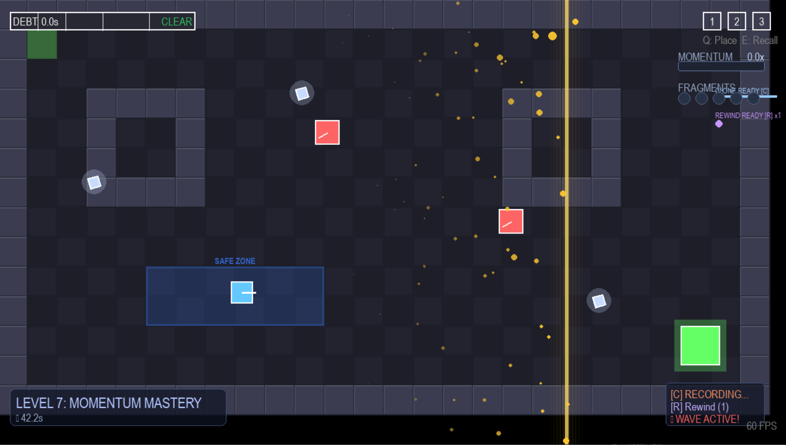

# TEMPORAL DEBT 2.0


> *Time is a loan you cannot afford.*

A puzzle-adventure game where the player can borrow time from the future to solve the present — but every second borrowed must be repaid later with interest.


## 🎮 Concept

**TEMPORAL DEBT** subverts the typical time-manipulation power fantasy. Instead of giving players godlike control over time, it treats time freezing as a Faustian bargain — powerful but costly.

### Core Mechanics

- **Time Freeze (SPACE)**: Hold to freeze time. You can move and plan while the world is stopped.
- **Temporal Debt**: Every second frozen accrues 1.5 seconds of debt.
- **Debt Repayment**: When time resumes, the world accelerates until your debt is repaid.
- **Debt Tiers**: Higher debt means faster world spee d, creating escalating difficulty.
- **Temporal Bankruptcy**: Exceed 20 seconds of debt and face extreme consequences.

### Unique Systems

| System | Descriptios |
|--------|-------------|
| **Temporal Echoes** | When frozen, see where enemies will be in the future |
| **Time Anchors** | Place up to 3 save points, recall at the cost of debt |
| **Debt Sinks** | Crystals that absorb debt (limi ted uses) |
| **Temporal Hunters** | Enemies that only move when time is frozen |
| **Debt Shadows** | Manifestations of high debt that chase you |

## ✨ V2.0 NEW FEATURES

### 🚀 Temporal Momentum
**Stay in motion, reduce your debt!**
- Build momentum by avoiding time freezes
- Up to 10x momentum multiplier
- Reduces debt accumulation rate by 5% per point
- Visual momentum meter on HUD

### ⏱️ Time Dilation Zones
**Strategic areas that alter debt physics**
- **Safe Zones (Blue)**: 0.75x debt rate - provides breathing room
- **Danger Zones (Red)**: 2x debt rate - high risk shortcuts
- Visual indicators show active effects

### 💎 Temporal Fragments
**Collectible time crystals with powerful effects**
- Scattered throughout levels
- Each fragment provides 1.5s debt reduction
- Collect 5 fragments for **Slow-Motion Burst** ability
- Emit particles and glow when nearby

### 👤 Chrono-Clone System
**Spawn temporal duplicates of yourself!**
- Records last 5 seconds of movement
- Press **C** to spawn a clone that replays your path
- Clones can distract enemies and trigger pressure plates
- 8 second cooldown between spawns

### 🌊 Resonance Events
**Periodic time waves create timing challenges**
- Waves occur every 15-20 seconds
- +3 second penalty if frozen during wave
- -0.5 second bonus if moving during wave
- Visual warning before each wave

### 📦 Debt Transfer Pods
**Store your debt for later... or for enemies!**
- Hold **F** to deposit debt into pods
- Can store up to 5 seconds of debt
- Strategic placement for puzzle solutions
- Release debt strategically

### ⏪ Time Reversal
**Limited rewind ability for critical moments**
- Press **R** to rewind 3 seconds
- Costs 8 seconds of debt
- 1 use per life - use wisely!
- Restores position, velocity, and debt

## 🚀 Getting Started

### Requirements

- Python 3.8+
- Pygame 2.5+

### Installation

```bash
# Clone or download the repository
cd temporal_debt

# Install dependencies
pip install -r requirements.txt

# Run the game
python main.py
```

## 🎯 Controls

| Key | Action |
|-----|--------|
| WASD / Arrows | Move |
| SPACE (hold) | Freeze Time |
| Q | Place Time Anchor |
| E | Recall to Nearest Anchor |
| C | Spawn Chrono-Clone |
| R | Time Rewind (1 use) |
| B | Fragment Burst (5 fragments) |
| F (hold) | Interact with Debt Pods |
| ESC | Pause Game |

## 📁 Project Structure

```
temporal_debt/
├── main.py                                     # Entry point
├── requirements.txt                            # Dependencies
├── README.md                                   # This file
│
├── docs/
│   ├── GAME_DESIGN_DOCUMENT.md
│   └── TECHNICAL_ARCHITECTURE.md
|
└── src/
    ├── core/                                   # Core game systems
    │   ├── game.py                             # Main game class
    │   ├── settings.py                         # Configuration
    │   ├── events.py                           # Event system
    │   └── utils.py                            # Utilities
    │
    ├── systems/                                # Game mechanics
    │   ├── time_engine.py                      # Time manipulation
    │   ├── debt_manager.py                     # Debt tracking
    │   ├── echo_system.py                      # Temporal echoes
    │   ├── anchor_system.py                    # Time anchors
    │   ├── collision.py                        # Collision detection
    │   ├── momentum_system.py                  # V2.0 Momentum
    │   ├── resonance_system.py                 # V2.0 Time waves
    │   ├── chrono_clone_system.py              # V2.0 Clones
    │   └── time_reversal_system.py             # V2.0 Rewind
    │
    ├── entities/                               # Game objects
    │   ├── player.py
    │   ├── enemies.py
    │   ├── interactables.py
    │   └── interactables_v2.py                 # V2.0 entities
    │
    ├── levels/                                 # Level system
    │   ├── level_manager.py
    │   ├── level_data.py
    │   ├── level_data_enhanced.py              # Levels 1-10
    │   └── tile.py
    │
    └── ui/                                     # User interface
        ├── hud.py
        ├── menus.py
        └── feedback.py
```

## 🎲 Levels (10 Total)

### Original Levels (1-6)

#### Level 1: The Vault
*Learn to borrow time... and pay it back.*

#### Level 2: The Gauntlet
*Multiple threats. Plan your path carefully.*

#### Level 3: The Debt Chamber
*Face the consequences of borrowed time.*

#### Level 4: Hunter's Den
*Temporal Hunters await in the shadows.*

#### Level 5: The Crucible
*Everything you've learned, put to the test.*

#### Level 6: The Sanctum
*The final challenge of the original journey.*

### NEW V2.0 Levels (7-10)

#### Level 7:  Momentum Mastery
*Learn the art of continuous movement.*
- Introduces Temporal Momentum system
- Time Dilation Zones (safe and danger)
- First Temporal Fragments

#### Level 8: Clone Protocol
*Your echo becomes your ally.*
- Chrono-Clone puzzle mechanics
- Clones trigger pressure plates
- Debt Transfer Pod introduction

#### Level 9: Resonance Chamber
*Dance with the time waves.*
- Resonance Events create timing challenges
- Multiple wave patterns
- Strategic use of safe zones

#### Level 10: Temporal Nexus
*The ultimate test of all abilities.*
- All V2.0 mechanics combined
- Complex enemy patterns
- Time Reversal is crucial
- Master-level challenge

## 🧠 Design Philosophy

### Time as Consequence
Unlike other time-manipulation games, freezing time in TEMPORAL DEBT isn't free. This creates:
- **Strategic depth**: When to freeze? For how long?
- **Tension**: Debt creates anxiety and urgency
- **Mastery expression**: Expert players minimize debt

### The Debt Spiral
High debt → faster world → harder gameplay → need to freeze → more debt

This feedback loop is intentional. It rewards restraint and punishes spam.

### Economic Metaphor
The debt system mirrors real-world lending:
- **Interest compounds** at higher tiers
- **Bankruptcy** has severe consequences
- **Debt sinks** are limited resourses

## 🔧 Technical Highlights

- **Clean Architecture**: Modular, well-documented codebase
- **Event System**: Decoupled communication between systems
- **Time Engine**: Sophisticated time scaling and freeze mechanics
- **Spatial Partitioning**: Efficient collision detection
- **State Machine**: Clean game state management

## 🚀 Future Development Ideas

- **Story Mode**: Narrative explaining the Temporal Borrower's origin
- **Endless Mode**: Procedurally generated rooms with escalating difficulty
- **Multiplayer**: Shared debt between players
- **Boss Encounters**: Debt Lords as challenging boss battles
- **Audio**: Dynamic music that responds to debt level
- **Level Editor**: Create and share custom levels

## 📊 V2.0 Technical Additions

- **Momentum System**: Rewards continuous movement with debt reduction
- **Resonance System**: Periodic time waves with state machine design
- **Clone System**: Movement recording and playback with interpolation
- **Reversal System**: Game state snapshot and restoration
- **Fragment Manager**: Collectible system with burst ability
- **Enhanced HUD**: Real-time V2 system status display

## 📜 License

MIT License - Feel free to use, modify, and distribute.

---

*TEMPORAL DEBT - A game about the cost of power.*
